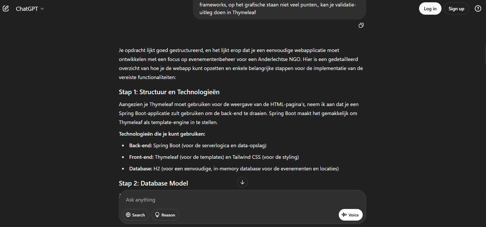
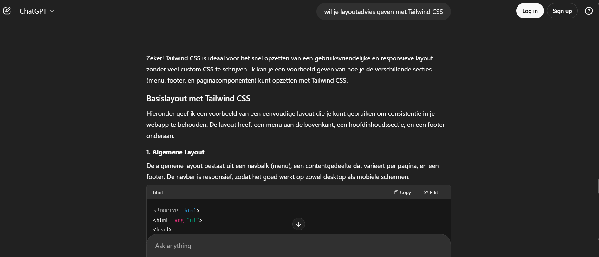
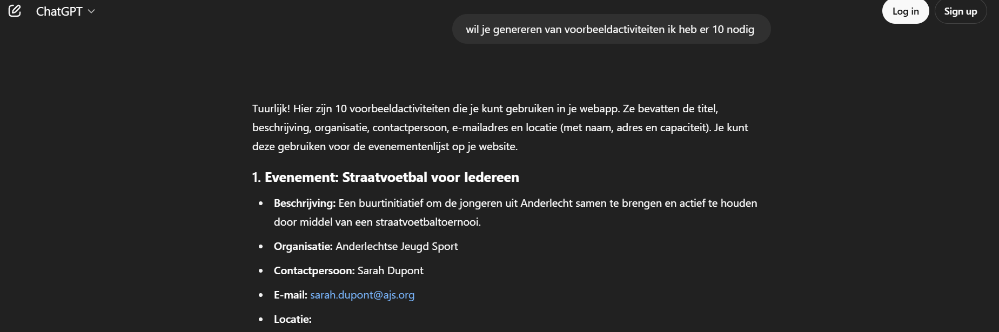

# 📄 Project: Website voor Anderlechtse NGO

## 🔧 Gebruikte technologieën
- Java 17  
- Spring Boot 3.5.0  
- Spring Data JPA  
- Thymeleaf  
- Tailwind CSS (via CDN)  
- Lombok  
- H2 Database (voor development)  

## 🔍 Functionaliteiten
- ✅ Overzichtspagina met de 10 laatste activiteiten  
- ✅ Detailscherm per activiteit  
- ✅ Formulier om een nieuwe activiteit toe te voegen (met validatie)  
- ✅ Algemene info-pagina over de NGO  
- ✅ Extra veld toegevoegd: Doelpubliek  
- ✅ Consistente navigatie en sticky footer met Tailwind CSS  

## 📚 Gebruikte bronnen
- [Spring Boot Documentatie](https://spring.io/projects/spring-boot)  
- [Thymeleaf Docs](https://www.thymeleaf.org/documentation.html)  
- [Tailwind CSS Docs](https://tailwindcss.com/docs)  
- [Spring Boot + Thymeleaf: Create and Validate Forms](https://youtu.be/-IMvhBWwQrc?si=9zvrb4tcJ2M3PFol)
- ChatGPT voor structuur- en layoutadvies  

## 🤖 AI-gebruik
Er is gebruik gemaakt van ChatGPT voor:  
- Validatie-uitleg in Thymeleaf   
- Layoutadvies met Tailwind CSS  
- Genereren van voorbeeldactiviteiten 

Hieronder screens van ondersteuning via ChatGPT:

### ✅ Validatie uitleg in Thymeleaf


### ✅ Layout advies met Tailwind CSS


### ✅ Genereren van voorbeeldactiviteiten



## 🚀 Deployment

### 🔧 Lokale installatie en runnen

1. **Clone het project**  
   ```bash
   git clone https://github.com/milatxx/radmila.tantaeva.git
   cd radmila.tantaeva
   ```

2. **Start de applicatie lokaal met Maven wrapper**  
   ```bash
   ./mvnw spring-boot:run
   ```

3. **Open de webapp in je browser**  
   ```
   http://localhost:8080
   ```

### 🗂️ Navigatie binnen de app

- `/` — Overzicht van de 10 laatste activiteiten  
- `/activiteit/toevoegen` — Formulier om een activiteit aan te maken  
- `/activiteiten/{id}` — Detailscherm van 1 activiteit  
- `/info` — About-pagina met uitleg over de NGO  

### 📦 Data en database

- De app gebruikt een in-memory H2 database (start leeg en vult zich met dummydata)  
- Dummydata wordt geladen bij het opstarten via `DataLoader.java`  

---

© 2025 Anderlechtse NGO
